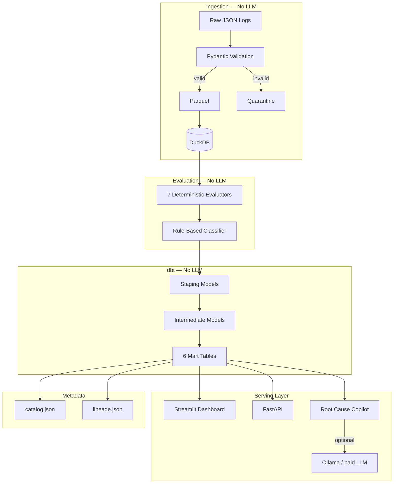
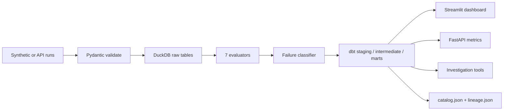
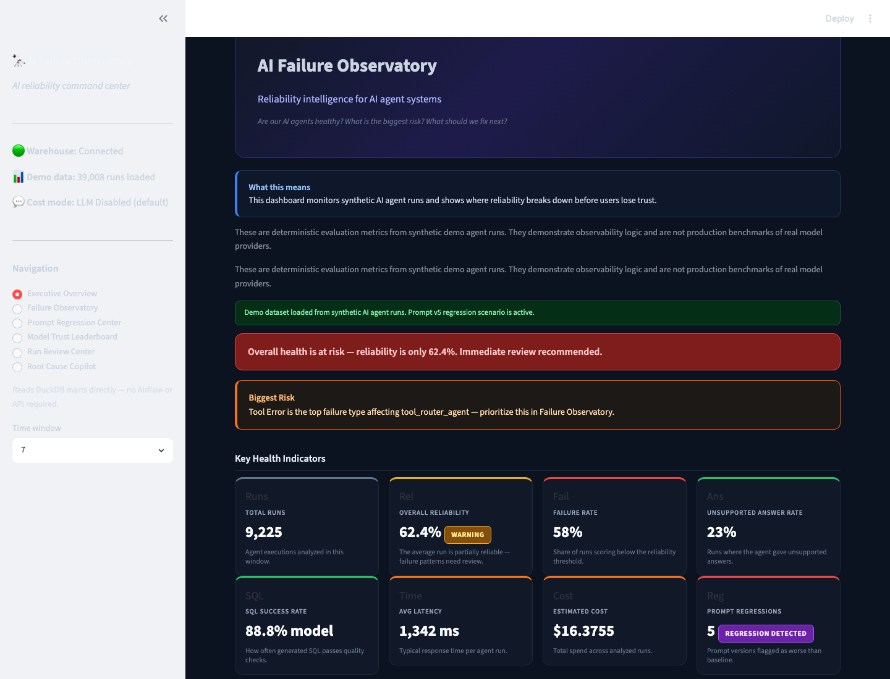
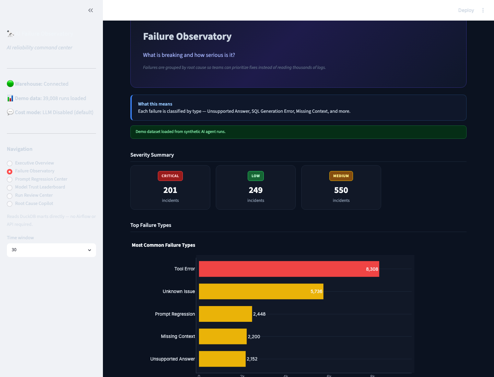
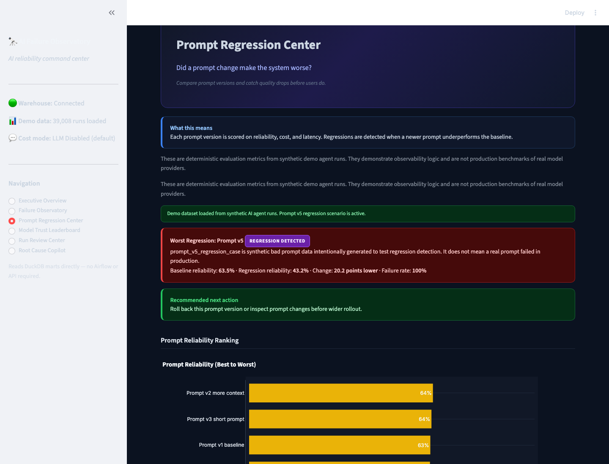
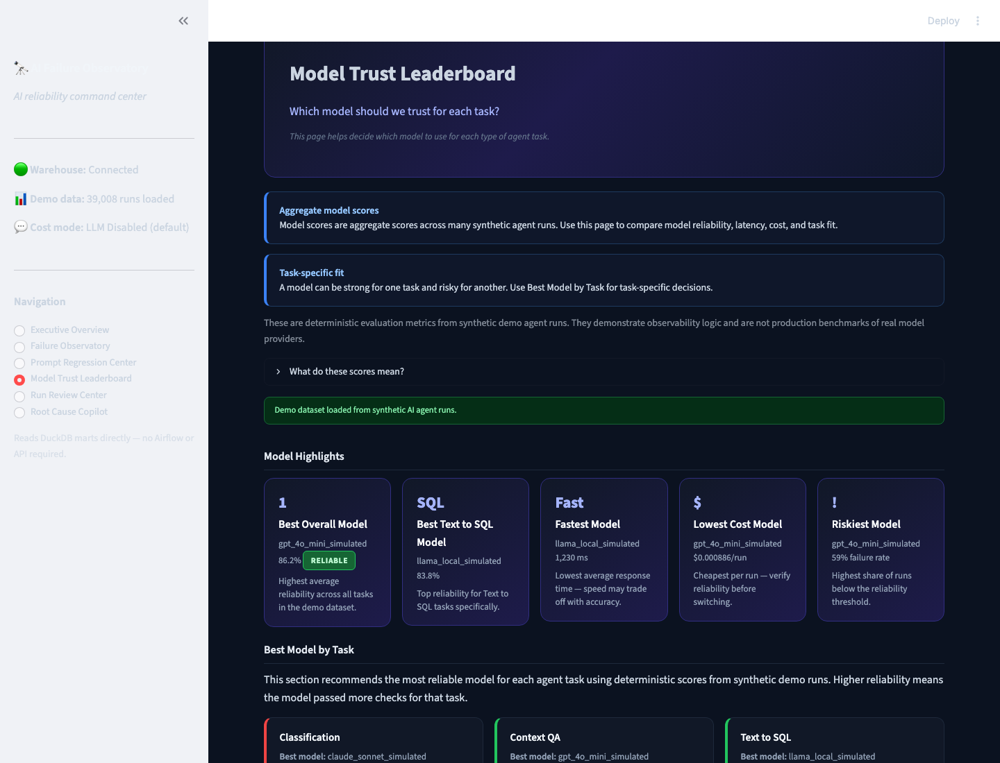
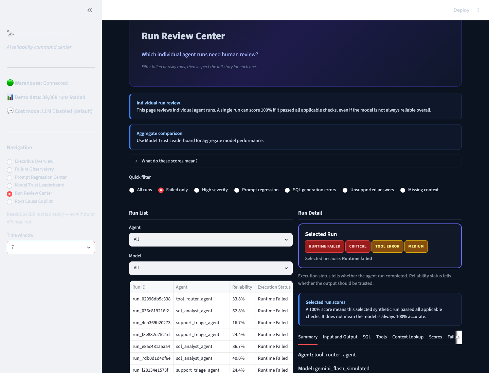
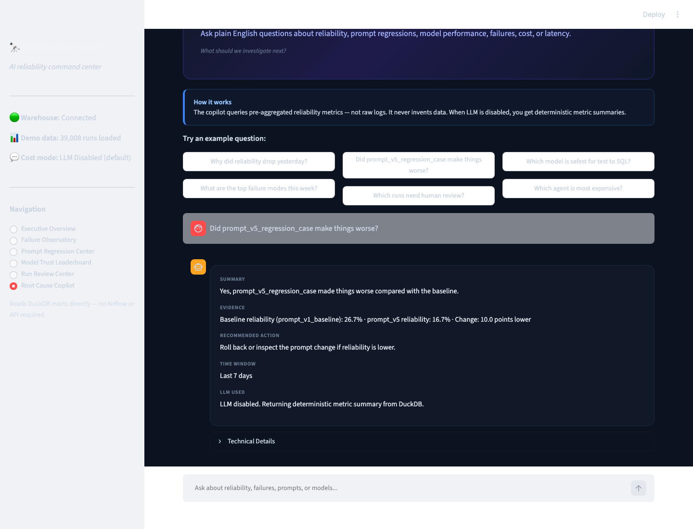

# AI Failure Observatory

**A local-first observability platform that scores synthetic AI agent runs with deterministic evaluators, aggregates reliability through dbt, and answers root-cause questions from DuckDB marts — with LLM disabled by default.**

> **Important:** All reliability scores, failure rates, and dashboard metrics come from **deterministic evaluation of synthetic demo agent runs**. This project demonstrates observability patterns; it does **not** benchmark real production traffic from GPT, Claude, Gemini, or Llama providers.

---

## Problem

AI agents fail in production for reasons standard logs rarely explain: prompt regressions, retrieval misses, SQL errors, wrong tool calls, unsupported answers, latency spikes, and cost overruns. Teams often see “request failed” without a clear signal of *what broke* or *what changed*.

## Why This Project Matters

| Challenge | This project’s approach |
|---|---|
| **Cost** | Per-run LLM judging at scale is expensive and noisy |
| **Correctness** | SQL parsing, tool status, and retrieval checks are deterministic |
| **Scale** | One investigation question summarizes thousands of runs from pre-aggregated marts |
| **Portfolio** | End-to-end data platform + AI reliability engineering at **$0 base cost** |

## Zero-Dollar Base Cost

| Component | Tool | Cost |
|---|---|---|
| Language | Python 3.11+ | Free |
| Warehouse | DuckDB | Free |
| Transform | dbt Core | Free |
| Validation | Pydantic v2 | Free |
| Dashboard | Streamlit | Free |
| API | FastAPI | Free |
| Agent | LangGraph + deterministic fallback | Free |
| LLM (optional) | Ollama or paid API | **Off by default** — pay only if you enable it |

**Base project cost: $0.00** — local-first, no Airflow, no cloud warehouse, no paid APIs required.

`OBSERVATORY_USE_LLM=false` by default. The full pipeline, dashboard, API, and Root Cause Copilot run without any LLM call.

---

## Architecture



## Data Flow



**Pipeline in plain English:**

```
Synthetic/API runs → validate → DuckDB raw tables
  → evaluate (7 scorers) → classify failures (11 categories)
  → dbt staging → intermediate → 6 marts
  → dashboard + API + investigation tools
  → catalog.json + lineage.json
```

---

## Tech Stack

Python 3.11 · DuckDB · dbt Core · Pydantic v2 · Streamlit · Plotly · FastAPI · LangGraph · sqlglot · pytest

See [docs/architecture.md](docs/architecture.md) for layer-by-layer detail.

---

## Features Implemented

- **Ingestion** — Pydantic v2 contracts, quarantine for bad records, duplicate detection, ingestion audit
- **Synthetic data** — 10K+ configurable runs with 12 injectable failure scenarios (including `prompt_v5_regression_case`)
- **Evaluation** — 7 deterministic scorers + task-aware weighted overall score (nulls excluded, not zeroed)
- **Classification** — 11-category failure taxonomy with severity and recommendations
- **dbt** — 5 staging, 5 intermediate, 6 mart models with schema tests
- **Dashboard** — 6 executive pages reading DuckDB marts directly (no Airflow or API required)
- **API** — Validated ingestion, read-only metrics, investigation endpoint
- **Root Cause Copilot** — 8 safe read-only tools; deterministic summaries when LLM is off
- **Metadata** — `catalog.json` and `lineage.json` from dbt manifest
- **Testing** — 110+ pytest cases across unit and integration suites

---

## Setup

**Prerequisites:** Python 3.11+, `git`

```bash
git clone <repo-url> && cd AI_Failure_Observability
python -m venv .venv && source .venv/bin/activate
pip install -r requirements.txt && pip install -e .
cp .env.example .env
python scripts/initialize_warehouse.py
python scripts/generate_synthetic_data.py --count 10000
python scripts/run_local_pipeline.py
python scripts/refresh_metadata.py
pytest tests/ -v
```

See [docs/local_setup.md](docs/local_setup.md) for troubleshooting.

---

## Full Run Commands

| Command | Purpose |
|---|---|
| `python scripts/initialize_warehouse.py` | Create DuckDB schema |
| `python scripts/generate_synthetic_data.py --count 10000` | Generate synthetic demo runs |
| `python scripts/run_local_pipeline.py` | Full pipeline: ingest → eval → classify → dbt |
| `python scripts/run_evaluations.py` | Re-run evaluators only |
| `python scripts/classify_failures.py` | Re-run failure classifier only |
| `python scripts/refresh_metadata.py` | Rebuild `catalog.json` and `lineage.json` |
| `export PYTHONPATH=$PWD && python -m streamlit run app/dashboard/streamlit_app.py` | Launch dashboard (port 8501) |
| `uvicorn app.api.main:app --reload --host localhost --port 8000` | Launch API |
| `python scripts/dashboard_quality_check.py` | Dashboard + copilot smoke validation |
| `python scripts/capture_dashboard_screenshots.py` | Capture README screenshots (Playwright) |
| `pytest tests/ -v` | Run all tests |

---

## Dashboard Screenshots

All scores shown are **deterministic metrics from synthetic demo runs** — not production model benchmarks.

### Executive Overview

KPI cards, reliability trend, failure rankings, and regression alerts.



### Failure Observatory

Severity breakdown, failure trends, top failure types, and incident cards.



### Prompt Regression Center

Baseline comparison, reliability ranking, and regression delta charts.



### Model Trust Leaderboard

Best-model-by-task cards, leaderboards, and cost vs reliability tradeoffs.



### Run Review Center

Quick filters, prioritized run selection, execution vs reliability status, tabbed run detail.



### Root Cause Copilot

Example questions with structured Summary, Evidence, Recommended Action, and Time Window.



### Regenerate screenshots

```bash
# Terminal 1
export PYTHONPATH=$PWD
python -m streamlit run app/dashboard/streamlit_app.py

# Terminal 2
export PYTHONPATH=$PWD
python scripts/capture_dashboard_screenshots.py
```

---

## Dashboard Page Overview

Six pages — custom sidebar navigation, reads DuckDB marts directly:

| Page | What you see |
|---|---|
| **Executive Overview** | Health KPIs, reliability trend, top failures, model/agent rankings, v5 regression alert |
| **Failure Observatory** | Severity cards, failure trend chart, top failure types, filterable incident table |
| **Prompt Regression Center** | v5 synthetic regression note, reliability ranking, baseline delta chart, regression cards |
| **Model Trust Leaderboard** | Best model by task cards, failure-rate leaderboards, optional heatmap expander |
| **Run Review Center** | Quick filters, run list with execution/reliability status, tabbed per-run detail |
| **Root Cause Copilot** | Six example questions, structured deterministic answers, technical details expander |

Every dashboard page that shows scores includes a disclaimer: these are synthetic demo metrics, not production benchmarks.

---

## API Overview

Base URL: `http://localhost:8000`

| Method | Route | Description |
|---|---|---|
| GET | `/health` | Warehouse and log directory status |
| POST | `/runs` | Ingest validated run payload |
| GET | `/runs` | List runs with filters |
| GET | `/runs/{run_id}` | Run detail with evaluations and failures |
| GET | `/evaluations` | List evaluation records |
| POST | `/evaluations/run` | Trigger evaluation batch |
| GET | `/metrics/overview` | Dashboard summary metrics |
| GET | `/metrics/failures` | Failure trends by category |
| GET | `/metrics/prompts` | Prompt version comparison |
| GET | `/metrics/models` | Model comparison by task |
| POST | `/investigate` | Natural-language investigation |

---

## Root Cause Copilot Overview

A constrained reliability analyst — **not** a general chatbot.

| Behavior | Detail |
|---|---|
| **Default mode** | `OBSERVATORY_USE_LLM=false` — deterministic Summary / Evidence / Recommended Action from DuckDB |
| **Tools** | 8 read-only tools: reliability, failures, prompts, models, runs, incidents, cost/latency, lineage |
| **Safety** | Rejects raw SQL and destructive keywords |
| **Time windows** | Defaults to last 7 days when ambiguous; states assumptions explicitly |
| **No fabrication** | Returns “data not available” when metrics are missing |

**Example questions (built into the dashboard):**

- Why did reliability drop yesterday?
- Did prompt_v5_regression_case make things worse?
- Which model is safest for text to SQL?
- What are the top failure modes this week?
- Which runs need human review?
- Which agent is most expensive?

Optional: enable Ollama or a paid LLM to rewrite the summary — still grounded in the same aggregated metrics.

---

## dbt Model Overview

| Layer | Models | Purpose |
|---|---|---|
| **Staging** | `stg_agent_runs`, `stg_tool_calls`, `stg_retrieval_events`, `stg_evaluation_results`, `stg_prompt_versions` | Clean raw DuckDB tables |
| **Intermediate** | `int_run_quality`, `int_failure_classification`, `int_prompt_performance`, `int_model_performance`, `int_tool_performance` | Joined, enriched metrics |
| **Marts** | `mart_agent_reliability`, `mart_failure_trends`, `mart_prompt_regression`, `mart_model_comparison`, `mart_cost_latency`, `mart_incident_summary` | Dashboard and API consumption |

See [docs/data_model.md](docs/data_model.md) and `dbt_project/models/marts/schema.yml` for column-level detail.

---

## Metadata and Lineage Overview

`python scripts/refresh_metadata.py` writes:

- **`data/metadata/catalog.json`** — dbt model catalog with descriptions and column metadata
- **`data/metadata/lineage.json`** — upstream/downstream edges between models

The Root Cause Copilot can query lineage for mart models. Refresh uses atomic writes — a failed refresh preserves the last known good files.

---

## Evaluation Methodology

All evaluators are **deterministic**. No LLM is called during evaluation.

| Evaluator | Method |
|---|---|
| Correctness | Numeric tolerance or keyword overlap vs expected answer |
| SQL | sqlglot parse, allowed tables/columns, blocks destructive SQL |
| Tool | Required tool presence, status, input/output checks |
| Retrieval | Relevance threshold, chunk usage |
| Format | Non-empty answer; JSON for classification tasks |
| Latency | Threshold tiers (good / degraded / fail) |
| Cost | USD threshold tiers |

**Overall score:** task-aware weighted average. Null component scores are **excluded** and weights redistributed — never treated as zero.

See [docs/evaluation_methodology.md](docs/evaluation_methodology.md).

---

## Failure Taxonomy

11 classified categories (rule-based, no LLM):

| Category | Dashboard label | Primary signals |
|---|---|---|
| `hallucination` | Unsupported Answer | Low correctness despite retrieval |
| `retrieval_failure` | Missing Context | Low retrieval score |
| `tool_failure` | Tool Error | Failed/skipped tool call |
| `sql_failure` | SQL Generation Error | SQL parse or semantic error |
| `prompt_regression` | Prompt Regression | Low score on `prompt_v5_regression_case` |
| `reasoning_failure` | Reasoning Error | Good components, wrong answer |
| `format_failure` | Output Format Error | Low format score |
| `latency_failure` | Slow Response | Latency score zero |
| `cost_failure` | Cost Spike | Cost score zero |
| `pipeline_failure` | Pipeline Issue | Duplicate run_id, ingestion error |
| `unknown` | Unknown Issue | Ambiguous signals |

**Severity:** critical · high · medium · low

See [docs/failure_taxonomy.md](docs/failure_taxonomy.md).

---

## Data Quality and Testing Strategy

| Layer | What is tested |
|---|---|
| **Schemas** | Pydantic v2 validation, coercion, range checks |
| **Evaluators** | SQL parsing, correctness, score exclusion logic |
| **Ingestion** | Quarantine, duplicates, malformed JSON |
| **Classification** | Category assignment, severity, recommendations |
| **dbt** | `not_null`, `accepted_values` on mart columns |
| **API** | Health, metrics shape, investigation with LLM off |
| **Dashboard** | Display helpers, chart formatting, copilot examples, page imports |
| **Metadata** | Catalog atomic write, lineage edge shape |

```bash
pytest tests/ -v
python scripts/dashboard_quality_check.py
```

110+ tests; Playwright screenshots are optional and not part of normal pytest.

---

## Edge Cases Handled

- **Ingestion:** empty files, malformed JSON, missing fields → quarantine; duplicates flagged
- **Evaluation:** null scores excluded from weighted average; destructive SQL blocked
- **Dashboard:** missing warehouse → actionable message; empty tables → empty states; NaN severity safe
- **Copilot:** LLM off → deterministic summaries; raw SQL rejected; missing metrics → explicit fallback
- **Metadata:** failed refresh discards temp file, keeps last good catalog/lineage

See [docs/edge_cases.md](docs/edge_cases.md).

---

## Known Limitations

- **Synthetic data only** — simulated agents/models (`gpt_4o_mini_simulated`, etc.); not real provider traffic
- **No orchestration** — local scripts replace Airflow DAGs (Airflow listed as future work)
- **No real-time streaming** — batch ingest and periodic pipeline runs
- **LLM summaries optional** — default copilot uses rule-based formatting, not generative reasoning
- **Single-node DuckDB** — not designed for multi-tenant production scale
- **prompt_v5_regression_case** — intentionally injected bad prompt for demo regression detection

---


## Future Work

- Apache Airflow DAGs for orchestration (scripts are Airflow-ready in spirit)
- Real-time log streaming
- Configurable alert thresholds in the dashboard
- DataHub or OpenMetadata integration (optional)
- Additional evaluator plugins per task type

See `PROJECT_SPEC.md` for the full build specification.

---

## Repository Structure

```
app/
  api/           FastAPI routes and Pydantic schemas
  dashboard/     Streamlit views and components
  agent/         Root Cause Copilot (LangGraph + deterministic fallback)
  services/      Warehouse reader, metrics, log writer
observatory/     Ingestion, evaluation, classification, synthetic data
dbt_project/     Staging, intermediate, and mart models
scripts/         CLI entry points and screenshot capture
tests/           Unit and integration tests
docs/            Architecture, taxonomy, interview materials, images/
data/            Warehouse, raw logs, metadata (gitignored)
```

## License

See repository license file. Built as a portfolio and interview demonstration project.
